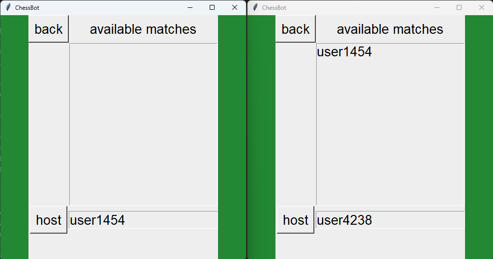
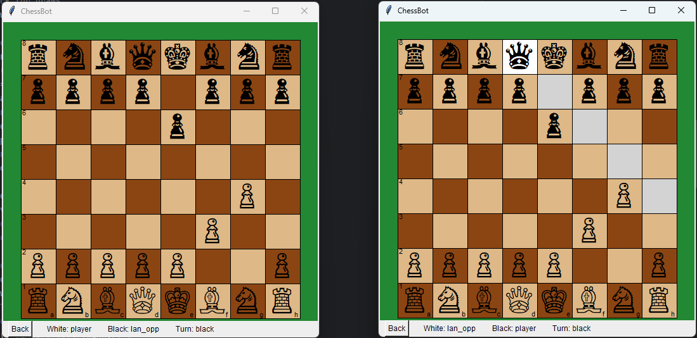

<figure>
    
    <figcaption>The chess app's new local area network menu. The instance on the left has hosted a match that is now visable and available for the player on the right!</figcaption>
</figure>
<figure>
    
    <figcaption>Two instances of the application playing a match. White has walked into a fool's mate!</figcaption>
</figure>

    I used the same project throughout each of the enhancements, but this enhancement turned out to be the most ambitious. The initial program opened immediately to a chess match and had no ability to network. A user could make moves or give a bot control of one or both sides. The goal of this enhancement was to give the program networking capabilities without involving a dedicated server. My initial plan involved using server frameworks like Flask or Django to handle communication but before long, I realized that this approach was awkward and my desired outcome was better achieved through sockets. I had next to no experience working directly with sockets, but I ended up learning a lot and enjoying the process.

    Many challenges arose as I created these networking capabilities. The first hurdle was allowing the player to decide whether or not they wanted to do a LAN match. This involved creating a start menu and a page designed to let players connect. Creating the socket connection was interesting due to the novelty and the need to dynamically agree upon the connection address and port. The biggest hurdle ended up revolving around blocking and threading. Some bugs that arose from blocked threads were difficult to notice.

    The end result was very satisfying when everything worked as expected. Opening to a start menu and having networking capabilities made the program feel much more complete. As an inherently multiplayer game, chess is a better experience when multiplayer functionality is facilitated. This enhancement worked toward multiple course outcomes with emphasis on outcome number four. Outcome four was achieved by selecting the proper approach and using it to create desirable networking features for users. Outcomes one and five are persistent through each enhancement as they are mindset and approach related. I used Git and documenting comments to address outcome one. To stay security minded, I implemented error handling and made sure to handle data received over sockets with caution. Any improperly formatted data that was received was skipped over to make sure no unexpected data was processed.

